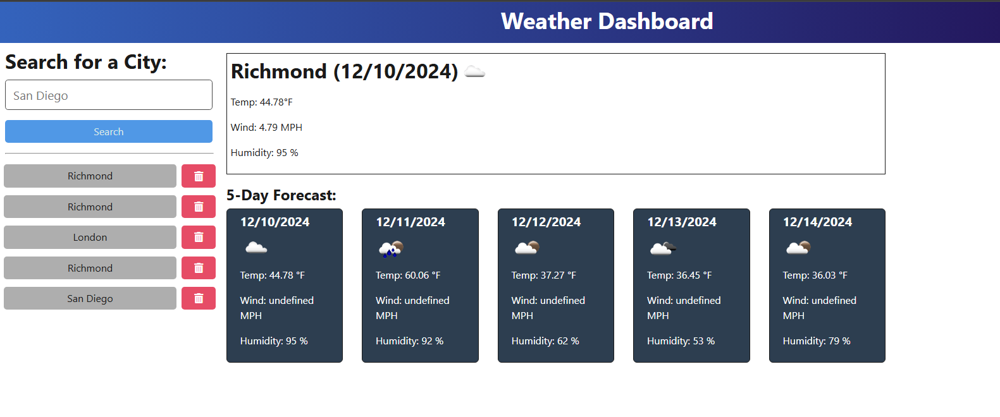

# OpenWeatherAPI Weather Dashboard 🌤️

## Description

A dynamic weather dashboard application that leverages the OpenWeather API to provide real-time weather information and 5-day forecasts for multiple cities. Perfect for travelers who need to plan their trips based on weather conditions across different locations.

## Table of Contents

- [OpenWeatherAPI Weather Dashboard 🌤️](#openweatherapi-weather-dashboard-️)
  - [Description](#description)
  - [Table of Contents](#table-of-contents)
  - [Installation](#installation)
  - [API Integration](#api-integration)
  - [Contribution](#contribution)
  - [Testing](#testing)
  - [Screenshots](#screenshots)
  - [License](#license)
  - [Questions](#questions)

## Installation

Clone the repository:
``git clone https://github.com/Madam_Loki/weather-dashboard.git``

Navigate to the project directory:
``cd weather-dashboard``

Install dependencies:
``npm install``

Build the project:
``npm run build``

Start the application:
``npm start``

## API Integration

This application uses the OpenWeather API to fetch weather data. To use this application, you will need to:

Sign up for an API key at OpenWeather
Create a .env file in the root directory
Add your API key: ``API_KEY=insertapikey``

## Contribution

While this project is not currently accepting contributions, if you'd like to suggest improvements:

Fork the repository
Create a feature branch
Commit your changes
Push to the branch
Open a pull request

## Testing

While formal tests are not currently implemented, you can verify the application's functionality by:

Testing different city searches
Verifying weather data accuracy
Checking responsive design on various devices
Validating search history functionality

## Screenshots

## License

This project is covered under the Unlicense license.

## Questions

For any questions, please contact me at [sara.j.ryan.90@gmail.com](mailto:sara.j.ryan.90@gmail.com).
GitHub: [Madam_Loki](http://github.com/Madam_Loki)
